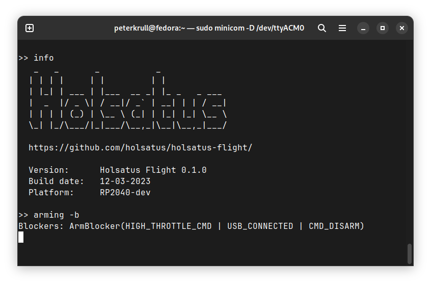

# Holsatus 🦀 Flight 

Holsatus Flight is a novel autopilot built in pure Rust. The firmware is designed around an the [Embassy](https://github.com/embassy-rs/embassy) framework and uses `async` functionality extensively to enable unprecedented efficiency with a high level of functionality.

The current implementation is designed for quad copters, and runs on the Raspberry Pi RP2040 chip (a sub $1 chip!), but support for other configurations and hardware is intended for the future.

## Features
- **Holsatus Shell** - An interactive environment for configuration and calibration.
- **Mavlink** - A Mavlink server enables Holsatus Flight to interact with standard GCS software.
- **Calibration** - Built-in calibration routines for the gyroscope, accelerometer and magnetometer
- **Configuration** - Fully configurable RC map, PID gains and more, at run-time, saved to flash storage.
- **Arming safety** - Various checks ensure that the vehicle will not arm in unsafe conditions.
- **Scheduling** - Interrupt-executors allows for high priority subsystems to preempt lower-priority ones.
- **Speed** - Due to the high efficiency of async, a modest RP2040 is able to run a steady 1000 Hz control loop.
- **Extensibility** - Adding new functionality only requires defining a new Embassy task and spawning it.

### Holsatus Shell

The inclusion of a shell interface makes configuring, calibrating and troubleshooting easy, only using your terminal and a serial console application, such as `minicom` or `PuTTY`. Whether it be getting or setting parameters, reading sensor data, reading status flags or walking through the accelerometer calibration routine, the simple terminal interface makes that easy.

<center>
    
</center>


## Getting started

As mentioned above, the current development hardware consists of a RP2040, mounted in a Raspberry Pi Pico board. The built-in drivers support the ICM20948 IMU+Magnetometer over I2C, SBUS receiver over UART, 4x DShot motors via PIO. It is recommended to have this hardware available for testing.

The currently recommended features are `rp2040`, to enable hardware-configuration specific to this chip, `overclock` to apply a 2x overclock, if possible, and `shell` to enable the serial-over-USB shell server for configuration and calibration.
```shell
cargo run --release --features "rp2040 overclock shell"
```

## What does Holsatus mean?
Since the main unique and novel characteristic of this autopilot is the use of the Rust programming language, I thought a nod to the crustacean-based mascot would be nice. I stumbled across a type of crab called the [Liocarcinus holsatus](https://en.wikipedia.org/wiki/Liocarcinus_holsatus), with the common name of "flying crab", which I found fitting. It is apparently also (like myself) local to the North Sea. Holsatus 🦀 is it!


## License
Holsatus Flight is licensed under the [Apache 2.0 License](https://www.apache.org/licenses/LICENSE-2.0).

## Contribution
This project is currently a personal exploratory project of mine ([the author](https://github.com/peterkrull/)), but I am open to contributions and expanding the scope of the project. I therefore welcome pull requests and discussions. Criticism and feedback is appreciated!

Any contribution intentionally submitted for inclusion in the work by you, as defined in the Apache-2.0 license, shall be licensed as above, without any additional terms or conditions.
