# `flight.rs` signal graph

Inter-task data flow for the `flight` binary on the MicoAir H743v2.

There is no central blackboard object: each labelled edge is a `pub static`
of `Watch<T>`, `Signal<T>`, `Channel<T>`, `Broadcast<T>` or `Atomic*`. The
sender side calls `.sender()` / `.signal()` / `.send()` / `.store()`;
the receiver side calls `.receiver()` / `.wait()` / `.recv()` / `.load()`.

Audited from `device/micoairh743v2-dev/src/bin/flight.rs` (tasks spawned
at lines 506-548) plus dependencies in `common/src/tasks/*` and
`device/micoairh743v2-dev/src/{alt_hold,rc_kill,battery,mtf01,resources}.rs`.

## Graph

```mermaid
flowchart LR
    %% =========================================================
    %% Sensors / drivers
    %% =========================================================
    subgraph SENS[Sensors and drivers]
      imu[imu_reader_task<br/>BMI088 via SPI2]
      mtf[mtf01_reader_task<br/>UART4]
      rc[rc_kill_task<br/>USART6 CRSF]
      bat[battery_monitor_task<br/>ADC]
      bmi270[bmi270_logger_task<br/>BMI270 SPI3]
    end

    %% =========================================================
    %% Estimators and inner control pipeline
    %% =========================================================
    subgraph CTRL[Estimators and controllers]
      att[att_estimator]
      a2e[ahrs_to_eskf_bridge]
      ang[controller_angle]
      a2r[angle_to_rate_bridge]
      rate[controller_rate]
      gov[motor_governor]
    end

    %% =========================================================
    %% Setpoint sources / mode / safety
    %% =========================================================
    subgraph POL[Mode setpoint and safety]
      fsm[mission_fsm_task]
      ah[alt_hold_task]
      fh[flow_hold]
      flip[flip_kill]
      run[gyro_runaway_kill]
    end

    %% =========================================================
    %% Pure sinks
    %% =========================================================
    subgraph LOG[Loggers - SD via ulog]
      imon[imu_monitor]
      mmon[motor_monitor]
      fpl[flow_position_logger]
      myl[mag_yaw_logger]
      uw[uart_writer_task<br/>SD + USB CDC]
    end

    motors(((4x DShot motors)))

    %% ---------- IMU fan-out ----------
    imu -->|CAL_MULTI_IMU_DATA_0| att
    imu -->|CAL_MULTI_IMU_DATA_0| rate
    imu -->|RAW_MULTI_IMU_DATA_0| imon
    imu -->|RAW_MULTI_IMU_DATA_0| flip
    imu -->|RAW_MULTI_IMU_DATA_0| run

    %% ---------- Attitude pipeline ----------
    att -->|AHRS_ATTITUDE_Q| a2e
    att -->|AHRS_ATTITUDE_Q| imon
    att -->|AHRS_ATTITUDE_Q| myl
    a2e -->|ESKF_ESTIMATE| ang
    a2e -->|ESKF_ESTIMATE| rate
    ang -->|ANGLE_TO_RATE_SP| a2r
    a2r -->|TRUE_RATE_SP| rate

    %% ---------- Rate -> mixer -> motors ----------
    rate -->|RATE_MOTORS_MIXED| gov
    rate -->|RATE_PID_TERMS| imon
    rate -->|RATE_REF_FILTERED| imon
    gov -->|MOTORS_STATE| mmon
    gov -->|MOTORS_STATE| imon
    gov -->|MOTORS_STATE| fh
    gov -->|MOTORS_STATE| fsm
    gov -.->|DShot300| motors

    %% ---------- Altitude / flow ----------
    mtf -->|LIDAR_ALT_M| ah
    mtf -->|LIDAR_ALT_M| fsm
    mtf -->|FLOW_VEL_MS| fh
    mtf -->|FLOW_VEL_MS| fpl
    ah  -->|TRUE_Z_THRUST_SP| rate
    ah  -->|TRUE_Z_THRUST_SP| imon
    fh  -->|TRUE_ATTITUDE_Q_SP| ang

    %% ---------- Battery ----------
    bat -->|BATTERY_FILTERED_MV| ah
    bat -->|BATTERY_TIER| fsm

    %% ---------- RC + FSM + kill switches ----------
    rc  -->|RC_CHANNELS| fsm
    rc  -->|COMMAD_ARM_VEHICLE<br/>on link loss| gov
    fsm -->|ALTITUDE_SETPOINT signal| ah
    fsm -->|MANUAL_BYPASS atomic| ah
    fsm -->|MANUAL_BYPASS atomic| a2r
    fsm -->|COMMAD_ARM_VEHICLE| gov
    flip -->|COMMAD_ARM_VEHICLE| gov
    run  -->|COMMAD_ARM_VEHICLE| gov

    %% ---------- bmi270_logger is a true island ----------
    bmi270 -.->|ulog::log only| uw

    %% ---------- All ulog::log calls funnel here ----------
    imon -.->|ulog::log| uw
    mmon -.->|ulog::log| uw
    fpl  -.->|ulog::log| uw
    myl  -.->|ulog::log| uw
    fsm  -.->|ulog::log| uw
    ah   -.->|ulog::log| uw
    rc   -.->|ulog::log| uw

    %% styling
    classDef sens fill:#dceefb,stroke:#3a6ea5,color:#000
    classDef ctrl fill:#e3f4dc,stroke:#3a7a3a,color:#000
    classDef pol  fill:#fde7c3,stroke:#a36b1a,color:#000
    classDef log  fill:#eee,stroke:#666,color:#000
    classDef motor fill:#f7d5d5,stroke:#a33,color:#000
    class imu,mtf,rc,bat,bmi270 sens
    class att,a2e,ang,a2r,rate,gov ctrl
    class fsm,ah,fh,flip,run pol
    class imon,mmon,fpl,myl,uw log
    class motors motor
```



Edge style legend:

- solid arrow: typed signal carrying control/sensor data (`Watch`, `Signal`, `Channel`)
- dotted arrow: free-form text via `ulog::log` (funnels through `uart_writer_task` to SD/USB)
- dashed arrow to `motors`: DShot300 frames out the timer/DMA

## Per-task signal IO

| Task | Subscribes to | Publishes |
|---|---|---|
| `imu_reader_task` (BMI088, SPI2) | -- | `RAW_MULTI_IMU_DATA[0]`, `CAL_MULTI_IMU_DATA[0]` |
| `mtf01_reader_task` (UART4) | -- | `LIDAR_ALT_M`, `FLOW_VEL_MS` |
| `rc_kill_task` (USART6 CRSF) | -- | `RC_CHANNELS`, `RC_LINK_READY`, `RC_EVENT`, `COMMAD_ARM_VEHICLE` (on link loss) |
| `battery_monitor_task` (ADC) | -- | `BATTERY_FILTERED_MV`, `BATTERY_TIER` |
| `bmi270_logger_task` (SPI3) | (own SPI driver) | text via `ulog::log` only |
| `att_estimator` | `CAL_MULTI_IMU_DATA[0]`, `CAL_MULTI_MAG_DATA[0]` | `AHRS_ATTITUDE_Q`, `AHRS_ATTITUDE` |
| `ahrs_to_eskf_bridge` | `AHRS_ATTITUDE_Q` | `ESKF_ESTIMATE` |
| `controller_angle` | `ESKF_ESTIMATE`, `TRUE_ATTITUDE_Q_SP` | `ANGLE_TO_RATE_SP` |
| `angle_to_rate_bridge` | `ANGLE_TO_RATE_SP`, `MANUAL_BYPASS` (gate) | `TRUE_RATE_SP` |
| `controller_rate` | `CAL_MULTI_IMU_DATA[0]`, `TRUE_Z_THRUST_SP`, `TRUE_RATE_SP`, `ESKF_ESTIMATE`, `ATTITUDE_INT_EN` | `RATE_MOTORS_MIXED`, `RATE_PID_TERMS`, `RATE_REF_FILTERED`, `RATE_FF_PREDICT` |
| `motor_governor` | `COMMAD_ARM_VEHICLE`, `RATE_MOTORS_MIXED` | `MOTORS_STATE`, DShot300 frames |
| `alt_hold_task` | `ALTITUDE_SETPOINT`, `MANUAL_BYPASS`, `LIDAR_ALT_M`, `BATTERY_FILTERED_MV` | `TRUE_Z_THRUST_SP` |
| `flow_hold` | `FLOW_VEL_MS`, `MOTORS_STATE` | `TRUE_ATTITUDE_Q_SP` |
| `flip_kill` | `RAW_MULTI_IMU_DATA[0]` | `COMMAD_ARM_VEHICLE` (on flip) |
| `gyro_runaway_kill` | `RAW_MULTI_IMU_DATA[0]` | `COMMAD_ARM_VEHICLE` (on runaway) |
| `mission_fsm_task` | `RC_CHANNELS`, `LIDAR_ALT_M`, `MOTORS_STATE`, `BATTERY_TIER` | `ALTITUDE_SETPOINT`, `MANUAL_BYPASS`, `COMMAD_ARM_VEHICLE` |
| `imu_monitor` | `RAW_MULTI_IMU_DATA[0]`, `MOTORS_STATE`, `AHRS_ATTITUDE_Q`, `RATE_PID_TERMS`, `RATE_REF_FILTERED`, `TRUE_Z_THRUST_SP` | `A,...`/`B,...` CSV via `ulog` |
| `motor_monitor` | `MOTORS_STATE` | `[mtr] …` text via `ulog` |
| `flow_position_logger` | `FLOW_VEL_MS` | `FLOW_EST_X_MM`, `FLOW_EST_Y_MM` atomics |
| `mag_yaw_logger` | `CAL_MULTI_MAG_DATA[0]`, `AHRS_ATTITUDE_Q` | `[mag] …` text via `ulog` |
| `uart_writer_task` | `ulog` queue | SD card + USB CDC |
| `param_storage_task` | -- | (stub) |

## Deliberate omissions

- `uart_writer_task` is reached by every `ulog::log(...)` call. Only major
  producers are shown with dotted edges; otherwise every task in the binary
  would terminate at it.
- `bmi270_logger_task` runs its own SPI3 driver and does not publish to the
  shared IMU slots -- it is a passive A/B comparison sensor.
- `mag_yaw_logger` subscribes to `CAL_MULTI_MAG_DATA[0]`, which is published
  by `compass_reader`, spawned here via `resources::alt_hold_task`.
- `param_storage_task` is spawned but is currently a stub with no signal
  traffic.
- The following `common/src/tasks/*` exist but are **not spawned** by
  `flight.rs`, so their associated signals have no producer here:
  `signal_router`, `calibrator`, `arm_blocker`, `commander`,
  `usb_manager`, `imu_manager`, `gnss_reader`, `eskf::main`,
  `controller_mpc`, `in_flight_estimator`, `rc_reader`, `rc_binder`.

## How to keep this file accurate

Re-derive the edges with these greps when the wiring changes:

```bash
# producers
grep -rnE '\.sender\(\)|\.signal\(|\.send_immediate\(' \
    common/src device/micoairh743v2-dev/src

# consumers
grep -rnE '\.receiver\(\)|\.wait\(\)|\.try_take\(\)|\.recv\(\)' \
    common/src device/micoairh743v2-dev/src

# bare statics that form blackboard slots
grep -rnE 'pub static.*(Watch|Signal|Channel|Broadcast|Atomic)' \
    common/src device/micoairh743v2-dev/src
```
